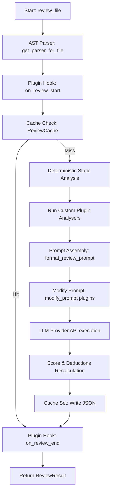

# Architecture

This document describes the design principles and processing stages of the Codivus review engine.

## Flow Diagram

## Engine Components

1. **AST Parser Pipeline:** Translates standard code files into `CodeContext` structures capturing module functions, dependencies, classes, and statements.
2. **Deterministic Rules Engine:** Runs syntax complexity, PEP8 style violations, unused files, dead code, and security vulnerability patterns.
3. **Structured Provider Wrappers:** Interfaces formatting structured schemas (leveraging Pydantic parsing features where supported, or structured JSON schema instructions on fallbacks).
4. **Caching Layer:** Local hashing matching file contents, avoiding network calls for identical source files.
